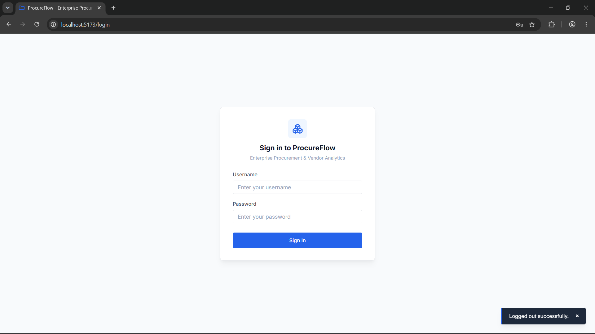
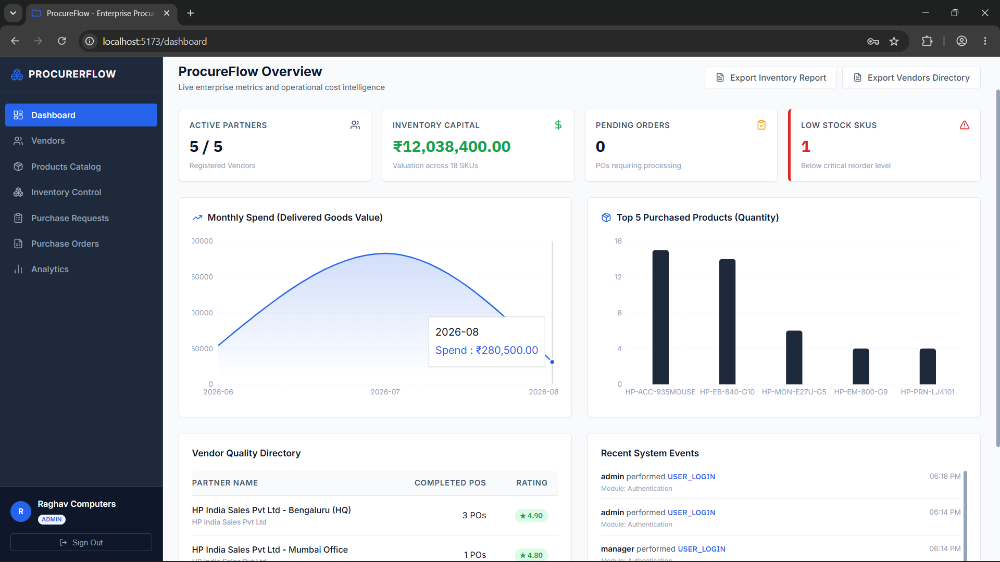
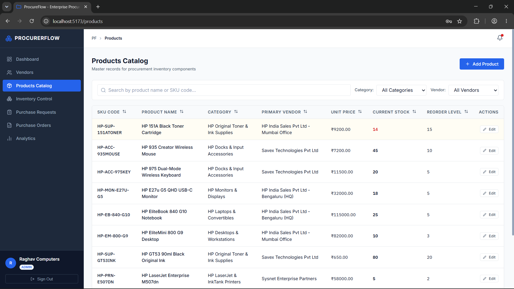
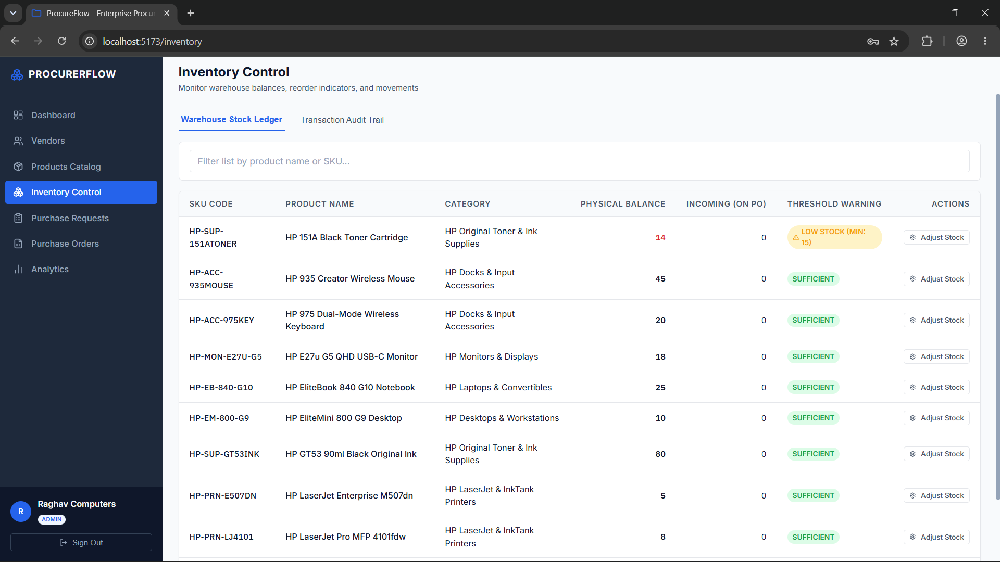
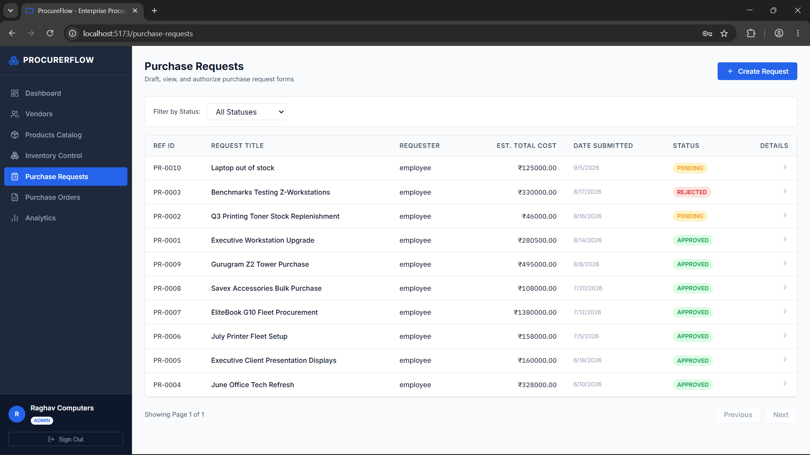
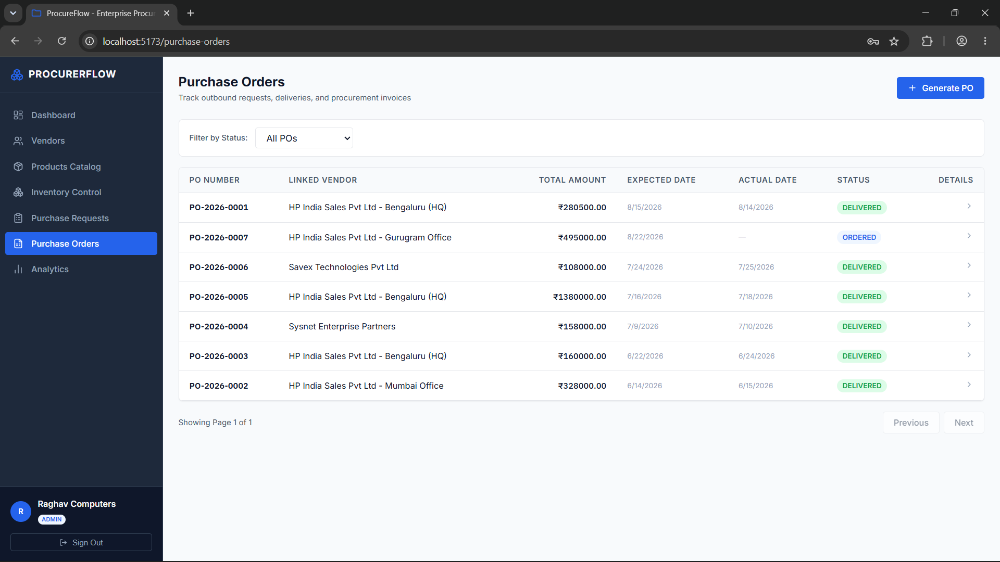
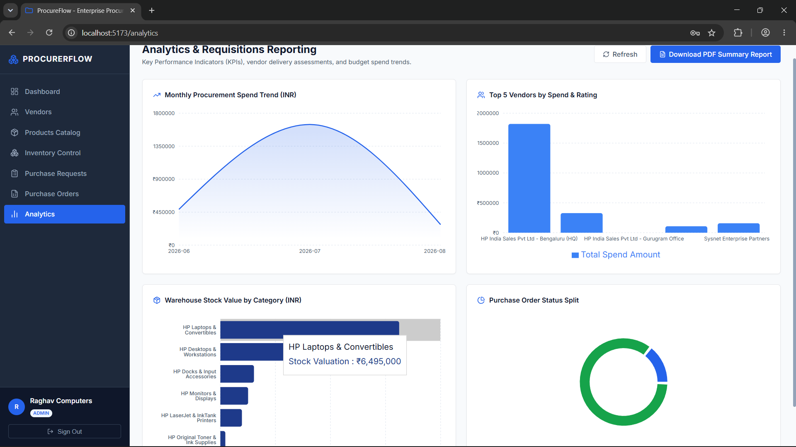
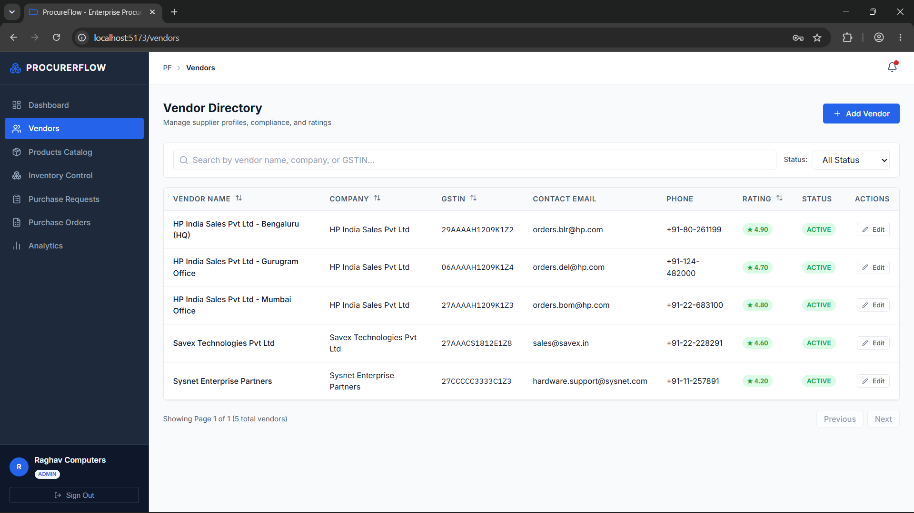
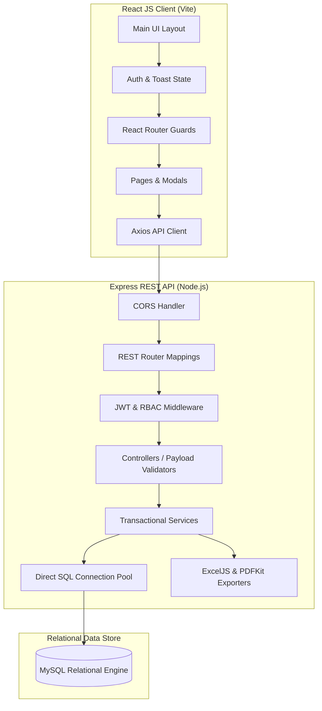

# ProcureFlow: Enterprise Procurement & Vendor Analytics Platform

ProcureFlow is a production-grade, full-stack enterprise internal application designed to streamline corporate procurement workflows, inventory management, purchase requisition lifecycle controls, and vendor performance analytics.

This project demonstrates clean architecture, 3NF database designs, secure JWT authentication with Role-Based Access Control (RBAC), and interactive data visualization.

The application is fully localized in **Indian Rupees (INR / ₹)** and pre-configured for an **HP World Centric product ecosystem** (covering commercial notebooks, Z-Workstations, LaserJet printer fleets, toner inventory, and office docking hubs).

---

## 🎨 System Highlights & Screenshots

### 1. Secure Portal Authentication
Security-first JWT sign-in screen supporting session recovery, password verification, and automatic token refresh mechanisms.



### 2. Operational Analytics Dashboard
Interactive, responsive 2D Recharts dashboard mapping monthly procurement spend trends, active vendor ratings, stock values by category, and purchase order splits.



### 3. Products Catalog Management
Administrative inventory catalog displaying pricing in Indian Rupees (₹), warehouse reorder limits, and preferred supplier vendors.



### 4. Warehouse Inventory Levels & Ledger
Real-time stock monitoring with low-stock warning indicators, manual adjustment modals, and a comprehensive transaction history audit log.



### 5. Purchase Requisitions & Approvals
Dynamic line-item selectors for employees to submit bulk requisitions and a manager review terminal to approve or reject items with custom feedback.



### 6. Purchase Orders (PO) & Logistics
Purchase requests conversion, shipping logistics updates, and in-memory generated invoice PDF downloads.



### 7. Interactive Analytics Visualizations
Visualized procurement KPIs including monthly spending trends, top 5 vendor performance metrics, and warehouse stock values.



### 8. Preferred Supplier Directory
Full database of authorized supplier partners complete with business registry numbers, contact parameters, ratings, and status monitors.



---

## 🏗️ Architecture & Data Flows

The platform is designed following the **Separation of Concerns (SoC)** principle, separating the React client frontend from the Node.js Express REST API backend:



---

## 💻 Technology Stack

### Backend
- **Node.js / Express**: RESTful route handlers and Router configuration.
- **MySQL2**: Connection pool handling, prepared statements, and transactional queries.
- **jsonwebtoken & bcryptjs**: Safe password hashing and stateless JWT verification.
- **ExcelJS & PDFKit**: In-memory Excel spreadsheets and PDF document generation.

### Frontend
- **ReactJS**: Component-driven Single Page Application.
- **Vite**: Ultra-fast bundler and hot module replacement.
- **Recharts**: Flat 2D visualization charts.
- **Lucide React**: Clean vector icons.
- **Vanilla CSS**: Clean, information-dense CSS (Atlassian/Jira design system).

---

## 🛠️ Installation & Local Setup

### Prerequisites
- **Node.js 18+**
- **MySQL Server 8+**
- **npm** or **yarn**

---

### Step 1: Initialize the Database (MySQL)
The platform uses a 3NF normalized MySQL database schema to manage assets, vendors, and transactions.

1. Open your local MySQL Command Line Client or GUI (e.g. MySQL Workbench).
2. Execute the schema script to design the database:
   ```sql
   SOURCE d:/Projects/New folder/procurement/database/schema.sql;
   ```
3. Populate mock transactions, historical records, and users with the seed script:
   ```sql
   SOURCE d:/Projects/New folder/procurement/database/seed.sql;
   ```

---

### Step 2: Start the REST API Backend
1. Navigate to the backend server directory:
   ```bash
   cd server
   ```
2. Create or verify the `.env` file with your local MySQL credentials:
   ```ini
   PORT=5000
   DB_HOST=127.0.0.1
   DB_PORT=3306
   DB_USER=root
   DB_PASSWORD=your_mysql_password
   DB_NAME=procureflow
   JWT_SECRET=your_jwt_secret_key
   JWT_EXPIRES_IN=24h
   ```
3. Install dependencies and start the Express server (runs on port `5000`):
   ```bash
   npm install
   npm run start
   ```

The console will print:
`ProcureFlow Express Server is running in development mode on port 5000`
`Database connected successfully to procureflow at 127.0.0.1:3306`

---

### Step 3: Start the React Frontend
Open a new terminal session, navigate to the `client/` directory, install dependencies, and boot Vite (runs on port `5173`):
```bash
cd client
npm install
npm run dev
```

The server will ready:
`➜  Local:   http://localhost:5173/`

---

## 🔑 Demo Login Credentials
All pre-seeded test accounts use the password **`Password123`**:

| Account Username | Role Access | Assigned Name | Operations |
| :--- | :--- | :--- | :--- |
| **`admin`** | **Admin** | `Raghav Computers` | System administration, vendors CRUD, analytics, configuration. |
| **`manager`** | **Manager** | `Priyanka Joshi` | Spend analysis charts, purchase request review terminal (Approve/Reject). |
| **`officer`** | **Procurement Officer** | `Rajesh Verma` | Inventory updates, catalog prices, receiving shipments, PO issuance. |
| **`employee`** | **Employee** | `Amit Patil` | Submitting asset purchase requests and self tracking. |

---

## 🧪 Running Automated API Tests
To run the automated backend route verification script, run this command in the server directory:
```bash
node server/utils/testAPIs.js
```
The console will verify connection integrity, successful authentication, JWT validations, and export endpoints.
